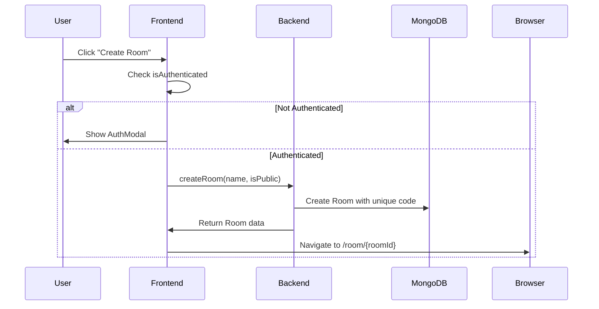
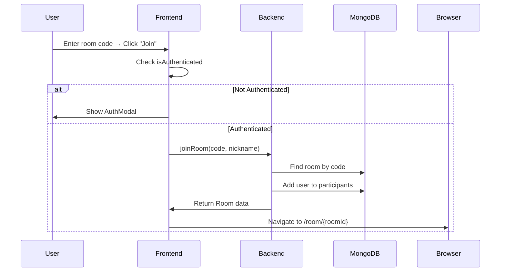
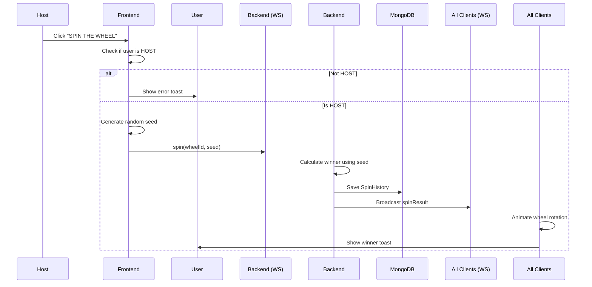

# 🎡 LuckyRoom Application Flow

## 📋 Tổng Quan

LuckyRoom là ứng dụng multiplayer wheel spinning realtime cho phép người dùng tạo room, mời bạn bè và cùng quay wheel để chọn winner ngẫu nhiên.

---

## 🔐 Authentication Flow

### 1. User Registration

```
Client → Backend
Mutation: register(email, nickname, password)
Response: { user, accessToken }
```

**Steps:**

1. User nhập thông tin vào `AuthModal`
2. Frontend gọi `REGISTER` mutation
3. Backend tạo user mới trong MongoDB
4. Backend return `accessToken` format: `mock-token-{userId}`
5. Frontend lưu token vào `localStorage`
6. Frontend gọi `window.location.reload()` để Apollo Client reload với token mới

### 2. Authenticated Requests

```
Client Request Headers:
Authorization: Bearer mock-token-{userId}

Backend Middleware (AuthMiddleware):
- Parse Bearer token
- Extract userId
- Set request.user = { id: userId }

Resolver:
@CurrentUser() decorator → lấy userId từ request.user
```

---

## 🏠 Home Page Flow

### Route: `/`

**Component:** `app/page.tsx`

**Features:**

- Create new room
- Join existing room by code
- View features
- Authentication modal

### Create Room Flow



**Validation:**

- ✅ User must be authenticated
- ✅ Room name must not be empty
- ✅ Auto-generate 6-character unique room code

### Join Room Flow



**Validation:**

- ✅ User must be authenticated
- ✅ Room code must exist
- ✅ Check password if room is private
- ✅ Check maxParticipants limit

---

## 🎮 Room Page Flow

### Route: `/room/[id]`

**Component:** `app/room/[id]/page.tsx`

### Page Load Sequence

```
1. Check Authentication
   └─> If not authenticated → Show AuthModal

2. Load Room Data
   └─> Query: room(id)
   └─> Store in useRoomStore

3. Load or Create Wheel
   └─> Try: wheelByRoom(roomId)
   └─> If not exists: createWheel(roomId, defaultSegments)
   └─> Store in useWheelStore

4. Connect WebSockets
   └─> Room Socket (participants updates)
   └─> Wheel Socket (spin events)
   └─> Chat Socket (messages)
```

### Real-time Connections

**3 Socket.IO Namespaces:**

1. **`/room`** - Room events

   - `joinRoom` - User joins room
   - `leaveRoom` - User leaves room
   - `userJoined` - Broadcast to all
   - `userLeft` - Broadcast to all

2. **`/wheel`** - Wheel events

   - `joinWheelRoom` - Subscribe to wheel updates
   - `spin` - Trigger wheel spin
   - `spinResult` - Broadcast spin result to all

3. **`/chat`** - Chat events
   - `joinChatRoom` - Subscribe to chat
   - `sendMessage` - Send text message
   - `sendEmoji` - Send emoji reaction
   - `newMessage` - Broadcast to all

---

## 🎡 Spin Wheel Flow

### User Action Flow



### Wheel Calculation Algorithm

**Backend Algorithm:**

```typescript
function calculateWinner(segments, seed):
  1. Calculate total weight = sum(segment.weight)
  2. Use seed to generate random value [0, totalWeight)
  3. Iterate segments until accumulated weight >= random value
  4. Return winning segment
```

**Frontend Animation:**

```typescript
function calculateRotation(winnerIndex, segmentCount):
  1. anglePerSegment = 360 / segmentCount
  2. targetAngle = 360 - (winnerIndex * anglePerSegment + anglePerSegment / 2)
  3. Rotate wheel to targetAngle with easing animation
```

---

## 💬 Chat Flow

### Send Message

```
User Input → Frontend (ChatBox)
   ↓
WebSocket: sendMessage(roomId, content)
   ↓
Backend: Validate & Save to MongoDB
   ↓
Broadcast: newMessage to all participants
   ↓
All Clients: Update chat UI
```

### Message Types

1. **TEXT** - Regular chat message
2. **SYSTEM** - System notifications
3. **SPIN_RESULT** - Spin result announcement
4. **USER_JOINED** - User joined notification
5. **USER_LEFT** - User left notification

---

## 📊 Data Models

### User

```typescript
{
  _id: string
  email: string
  nickname: string
  avatar?: string
  createdAt: Date
}
```

### Room

```typescript
{
  _id: string
  code: string           // 6-char unique code
  name: string
  hostId: string         // User ID of creator
  participants: Participant[]
  isPublic: boolean
  isActive: boolean
  createdAt: Date
}
```

### Participant

```typescript
{
  userId: string;
  nickname: string;
  role: RoomRole; // HOST | PLAYER | SPECTATOR
  status: ParticipantStatus; // ONLINE | OFFLINE
  joinedAt: Date;
}
```

### Wheel

```typescript
{
  _id: string
  roomId: string
  title: string
  segments: WheelSegment[]
  createdAt: Date
}
```

### WheelSegment

```typescript
{
  id: string
  text: string
  color: string
  weight: number        // For probability
  order: number
  icon?: string
}
```

### SpinHistory

```typescript
{
  _id: string;
  roomId: string;
  wheelId: string;
  spinnerId: string; // Who spun
  spinnerNickname: string;
  result: string; // Winner text
  segmentId: string; // Winner segment ID
  seed: number; // Random seed used
  rotation: number; // Final rotation angle
  spunAt: Date;
}
```

---

## 🔄 State Management

### Zustand Stores

1. **authStore** - Authentication state

   - `user` - Current user
   - `accessToken` - JWT token
   - `isAuthenticated` - Boolean flag
   - `login()`, `logout()`

2. **roomStore** - Room state

   - `currentRoom` - Room data
   - `participants` - List of participants
   - `setCurrentRoom()`

3. **wheelStore** - Wheel state

   - `currentWheel` - Wheel data
   - `isSpinning` - Spinning flag
   - `currentSpin` - Last spin result
   - `startSpin()`, `endSpin()`

4. **chatStore** - Chat state
   - `messages` - Chat messages
   - `addMessage()`, `clearMessages()`

---

## 🎯 Key Features

### 1. Realtime Synchronization

- All clients see same wheel spin animation
- Chat messages appear instantly
- Participant list updates in realtime
- Spin results are synchronized

### 2. Role-Based Permissions

- **HOST**: Can spin wheel, manage room, kick users
- **PLAYER**: Can chat, view spins
- **SPECTATOR**: View only

### 3. Weighted Probability

- Each segment has a weight value
- Higher weight = higher chance of winning
- Uses seed-based RNG for reproducibility

### 4. Offline Handling

- Users marked as OFFLINE when disconnected
- Room persists even if host leaves
- Reconnection automatically updates status

---

## 🐛 Error Handling

### Common Scenarios

1. **No Authentication**

   - Show AuthModal
   - Redirect to home after auth

2. **Room Not Found**

   - Toast error message
   - Redirect to home

3. **Connection Lost**

   - Attempt reconnection
   - Show offline indicator
   - Queue messages for retry

4. **Invalid Permissions**
   - Toast error
   - Disable restricted actions

---

## 📡 API Endpoints

### GraphQL Queries

```graphql
# User
query GetMe { me { ... } }
query GetUser($id: ID!) { user(id: $id) { ... } }

# Room
query GetRoom($id: ID!) { room(id: $id) { ... } }
query GetRoomByCode($code: String!) { roomByCode(code: $code) { ... } }

# Wheel
query GetWheel($id: ID!) { wheel(id: $id) { ... } }
query GetWheelByRoom($roomId: ID!) { wheelByRoom(roomId: $roomId) { ... } }

# History
query GetSpinHistory($input: GetHistoryInput!) { spinHistory(input: $input) { ... } }
query GetStatistics($roomId: ID!) { roomStatistics(roomId: $roomId) { ... } }
```

### GraphQL Mutations

```graphql
# Auth
mutation Register($input: CreateUserInput!) { register(input: $input) { ... } }
mutation Login($input: LoginInput!) { login(input: $input) { ... } }

# Room
mutation CreateRoom($input: CreateRoomInput!) { createRoom(input: $input) { ... } }
mutation JoinRoom($input: JoinRoomInput!) { joinRoom(input: $input) { ... } }
mutation LeaveRoom($roomId: ID!) { leaveRoom(roomId: $roomId) { ... } }

# Wheel
mutation CreateWheel($input: CreateWheelInput!) { createWheel(input: $input) { ... } }
mutation UpdateWheel($input: UpdateWheelInput!) { updateWheel(input: $input) { ... } }
```

### WebSocket Events

**Emit (Client → Server):**

- `joinRoom(roomId)`
- `leaveRoom(roomId)`
- `spin(wheelId, seed)`
- `sendMessage(roomId, content)`
- `sendEmoji(roomId, emoji)`

**Listen (Server → Client):**

- `userJoined(participant)`
- `userLeft(userId)`
- `spinResult(spinData)`
- `newMessage(message)`

---

## 🚀 Deployment Checklist

### Backend

- [ ] Set proper MONGODB_URI
- [ ] Generate strong JWT_SECRET
- [ ] Configure CORS_ORIGIN
- [ ] Set NODE_ENV=production
- [ ] Enable rate limiting
- [ ] Setup proper authentication (replace mock tokens)

### Frontend

- [ ] Update NEXT_PUBLIC_API_URL
- [ ] Update NEXT_PUBLIC_WS_URL
- [ ] Configure production domain
- [ ] Enable analytics
- [ ] Test all flows end-to-end

---

## 📚 Technology Stack

**Frontend:**

- Next.js 15 (App Router)
- TypeScript
- Tailwind CSS
- Apollo Client (GraphQL)
- Socket.IO Client
- Zustand (State Management)
- Framer Motion (Animations)
- React Hot Toast (Notifications)

**Backend:**

- NestJS
- GraphQL (Apollo Server)
- Socket.IO
- MongoDB + Mongoose
- TypeScript
- JWT Authentication

---

**📝 Note:** Tài liệu này mô tả luồng hoạt động hiện tại của ứng dụng. Để deploy production, cần thay thế mock authentication bằng JWT thực sự và implement thêm các tính năng bảo mật.
